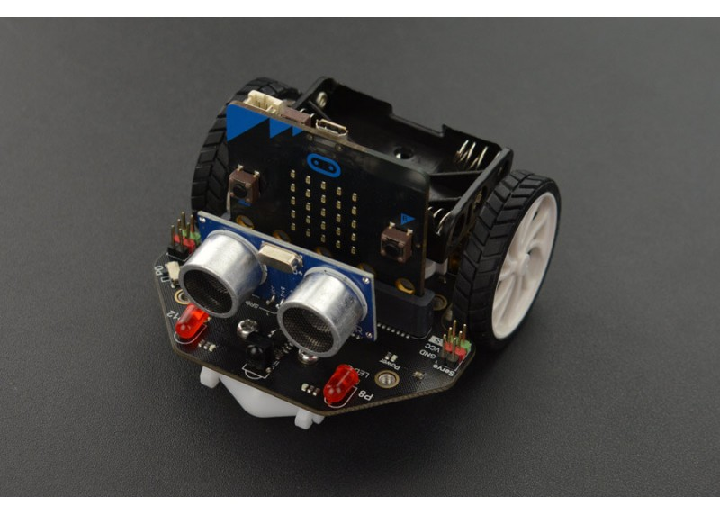

¿Que es STEAM? ¿Qué es un robot maqueen?

-  El término STEAM surge de las siglas en inglés de:  Science, Technology, Engineering, Arts & Mathematics

- Maqueen  es un robot de programación gráfica para educación STEM diseñado para BBC micro: bit. Su chasis es plug and 
  play y permite aprender rápidamente programación gráfica para entretener y fomentar el interés en la ciencia y el pensamiento lógico  
  
  
